# 🧠 AI Lab Framework

<div align="center">


*A clean, organized framework for building AI-powered development environments*

</div>

---

## 📖 Table of Contents

*   [🚀 Quick Start](#-quick-start)
*   [📊 Status Overview](#-status-overview)
*   [📁 Framework Structure](#-framework-structure)
*   [🎯 Key Features](#-key-features)
*   [🛠️ Development](#-development)
*   [📚 Documentation](#-documentation)
*   [📈 Changelog](#-changelog)
*   [🏗️ Architecture](#-architecture)
*   [🤝 Contributing](#-contributing)
*   [📄 License](#-license)
*   [🙏 Acknowledgments](#-acknowledgments)

---

## 🚀 Quick Start

Get up and running with the AI Lab Framework in minutes!

```bash
# 1. Clone the repository
git clone https://github.com/HerrSensei/ai-lab.git
cd ai-lab

# 2. Install dependencies using Poetry
poetry install

# 3. Set up your development environment
cp .env.template .env
# Edit .env with your specific configurations (e.g., API keys, database paths)

# 4. Run the framework (example: start a session)
python -m ai_lab_framework
```

For more detailed instructions, refer to the [Getting Started Guide](core/docs/GETTING_STARTED.md).

---

## 📊 Status Overview

### 🎯 Work Items (49 total)

| Status | Count | Progress |
|--------|-------|----------|
| ✅ Done | 20 | 40.8% |
| 🔄 In Progress | 6 | 12.2% |
| 📋 To Do | 12 | 24.5% |
| 🔓 Open | 7 | 14.3% |
| 📦 Backlog | 1 | 2.0% |
| ✅ Completed | 2 | 4.1% |
| ❌ Cancelled | 1 | 2.0% |

**By Priority:**
- 🔴 Critical: 1
- 🔴 High: 36
- 🟡 Medium: 12

**By Type:**
- 🛠️ FRM (Framework): 35
- 🔧 HS (Hotfix): 9
- 🏗️ INF (Infrastructure): 3
- 🔄 HYB (Hybrid): 1
- 💡 IDEA: 1

### 💡 Ideas (11 total)

| Status | Count | Progress |
|--------|-------|----------|
| 🔄 Converted | 5 | 45.5% |
| ✅ Implemented | 2 | 18.2% |
| 📦 Backlog | 4 | 36.4% |

**By Priority:**
- 🔴 High: 6
- 🟡 Medium: 5

### 🏗️ Projects (1 total)

| Project | Status | Description |
|---------|--------|-------------|
| 🏠 homelab-agent-os | ✅ Complete | Home infrastructure automation with agent OS |

---

## 📁 Framework Structure

```
├── 📂 src/                    # Core framework code
│   ├── 🤖 ai_lab_framework/   # Main framework modules
│   ├── 🔌 core/               # Core interfaces and ports
│   └── 🏗️ infrastructure/     # Database and AI services
├── 📂 core/                   # Templates and documentation
│   ├── 📚 docs/               # Comprehensive framework documentation
│   ├── 📋 guidelines/         # Development standards and best practices
│   └── 📄 templates/          # Project scaffolding templates
├── 📂 tools/                  # Specialized tool implementations
│   └── 🌐 fritzbox/           # Network automation tools (e.g., Fritz!Box integration)
├── 📂 data/                   # Structured data management
│   ├── 💡 ideas/              # Innovation ideas with status tracking
│   ├── 📋 work-items/         # Task and project management items
│   └── 🗂️ schemas/            # JSON schemas for data validation
├── 📂 scripts/                # Utility and automation scripts
├── 📂 projects/               # Generated project instances
└── 📂 tests/                  # Automated test suite
```

---

## 🎯 Key Features

### ✅ **Core Framework**
- **Multi-AI Service Support**: Seamless integration with OpenAI, Gemini, and an extensible architecture for other AI providers.
- **Profile System**: A robust three-tier configuration (`Experimental`, `Standard`, `Production`) to adapt to various development stages and criticality levels.
- **Database Integration**: Powered by SQLite with SQLAlchemy ORM for efficient data persistence and comprehensive migration capabilities.
- **Tool Generation**: A dynamic system for automated tool creation and streamlined management.
- **GitHub Integration**: Advanced features for repository management, issue synchronization, and automation workflows.

### ✅ **Data Management**
- **JSON-based Work Items**: Structured management of 49 tasks with rigorous schema validation for data integrity.
- **Ideas System**: Tracking and nurturing of 11 innovation concepts, complete with status and priority management.
- **Schema Validation**: Comprehensive JSON schemas ensuring the integrity and consistency of all framework data.
- **Migration Tools**: Automated utilities for seamless data migration and robust backup systems.

### ✅ **Development Tools**
- **Project Templates**: Extensive scaffolding for diverse project types, ensuring rapid and consistent project initiation.
- **CLI Workflows**: Over 20 documented command-line procedures for efficient session management, project tasks, QA, and deployment.
- **Code Quality**: Integrated with Black, Ruff, and MyPy, enforced by pre-commit hooks for pristine code quality.
- **Testing**: A comprehensive Pytest suite with coverage analysis, ensuring robust and reliable code.

### ✅ **Documentation**
- **Comprehensive Guides**: In-depth documentation covering project vision, development guidelines, and best practices.
- **API Documentation**: Auto-generated and meticulously maintained reference documentation for all framework APIs.
- **Tutorials**: Step-by-step implementation guides to accelerate developer onboarding and feature adoption.
- **Changelog**: A detailed version history and transparent change tracking for all framework updates.

---

## 🛠️ Development

### Code Quality Tools
```bash
# Code formatting with Black
black .

# Linting and auto-fixing with Ruff
ruff check --fix .

# Static type checking with MyPy
mypy .

# Run all pre-commit hooks
pre-commit run --all-files
```

### Testing
```bash
# Run all tests
pytest

# Run tests with coverage report
pytest --cov=src

# Stop on the first test failure
pytest -x
```

### Project Management
```bash
# List all active work items
python scripts/list_work_items.py

# List all innovation ideas
python scripts/list_ideas.py

# Generate a new project from templates
python -m ai_lab.tools.project_generator
```

---

## 📚 Documentation

Explore the comprehensive documentation to maximize your use of the AI Lab Framework:

*   [**Getting Started Guide**](core/docs/GETTING_STARTED.md): Your first steps with the framework.
*   [**Developer Guide**](core/docs/DEVELOPER_GUIDE.md): In-depth documentation for human developers.
*   [**AI Agent Guide**](core/docs/AI_AGENT_GUIDE.md): Specific instructions and guidelines for AI agents.
*   [**Framework Structure**](core/docs/FRAMEWORK_STRUCTURE.md): A complete overview of the framework's architecture.
*   [**CLI Workflows**](core/docs/CLI_WORKFLOWS.md): Standard operating procedures for command-line interactions.
*   [**Development Guidelines**](core/guidelines/AGENTS.md): General development standards and best practices.
*   [**Project Vision**](core/guidelines/VISION.md): The long-term vision and roadmap for the project.
*   [**Database Architecture Guide**](core/guidelines/DATABASE_ARCHITECTURE_GUIDE.md): Detailed insights into the database design and usage.
*   [**GitHub Integration Guides**](core/docs/GITHUB_SETUP.md): Comprehensive guides for integrating with GitHub (Setup, PAT, Auto-Sync, Optimization).
*   [**Deployment & Release Strategy**](core/docs/DEPLOYMENT_RELEASE_STRATEGY.md): The strategy for deploying and releasing the framework.
*   [**Homelab Overview**](core/docs/HOMELAB_OVERVIEW.md): Documentation related to the homelab setup.
*   [**Vocabulary Dictionary**](VOCABULARY.md): A glossary of key terms used within the project.

---

## 📈 Changelog

### 🆕 [Version 2.0.0] - 2025-11-13

#### ✨ Added
- Clean framework rebuild from messy backup
- JSON-based ideas management system (11 ideas)
- Complete project scaffolding templates
- Three-tier AI tool profile system
- Comprehensive documentation and workflows
- FritzBox MCP server integration
- Schema validation for all data structures

#### 🔄 Changed
- Migrated from markdown-based to JSON-based data management
- Improved framework architecture with clean separation of concerns
- Enhanced project templates with modern best practices
- Updated naming conventions for consistency

#### 🐛 Fixed
- Eliminated organizational complexity from original framework
- Resolved duplicate documentation issues
- Fixed broken component references
- Cleaned cache and artifact accumulation

#### 🔒 Security
- Improved API key management guidelines
- Enhanced input validation with Pydantic
- Added security best practices to templates

**[📋 View Full Changelog →](ai-logs/changelogs/CHANGELOG.md)**

---

## 🏗️ Architecture

### 🎯 Three-Tier Profile System

1.  **🔧 Development Profile**: Optimized for local development with local AI services, development databases, and debug logging.
2.  **🚀 Staging Profile**: Configured for testing and validation with cloud AI services, staging databases, and performance monitoring.
3.  **🌐 Production Profile**: Hardened for live environments with production AI services, robust databases, and security-enhanced configurations.

### 🔄 Data Flow

```mermaid
graph TD
    A[📝 Input] --> B{🔍 Validation}
    B --> C[🤖 AI Processing]
    C --> D[💾 Storage]
    D --> E[📊 Output]

    subgraph Data Layers
        B -- Schemas --> F[📋 Schemas]
        C -- LLMs --> G[🧠 LLMs]
        D -- Database --> H[🗄️ Database]
        E -- Reports --> I[📈 Reports]
    end
```



---

## 🤝 Contributing

We welcome contributions to the AI Lab Framework!

1.  **Fork** the repository.
2.  **Create** a feature branch (`git checkout -b feature/your-feature-name`).
3.  **Commit** your changes (`git commit -m 'feat: Add amazing feature'`).
4.  **Push** to the branch (`git push origin feature/your-feature-name`).
5.  **Open** a Pull Request, ensuring all checks pass.

### Development Requirements
- Python 3.11+
- Poetry for dependency management
- Adherence to [Development Guidelines](core/guidelines/AGENTS.md)
- All tests must pass
- Documentation updated as needed

---

## 📄 License

This project is licensed under the MIT License - see the [LICENSE](LICENSE) file for details.

---

## 🙏 Acknowledgments

- **AI Agents** for framework development and maintenance.
- **Open Source Community** for the amazing tools and libraries.
- **Contributors** who help improve this framework.

---

<div align="center">

**🌟 Star this repository if it helps you!**

Made with ❤️ by the AI Lab Team

</div>